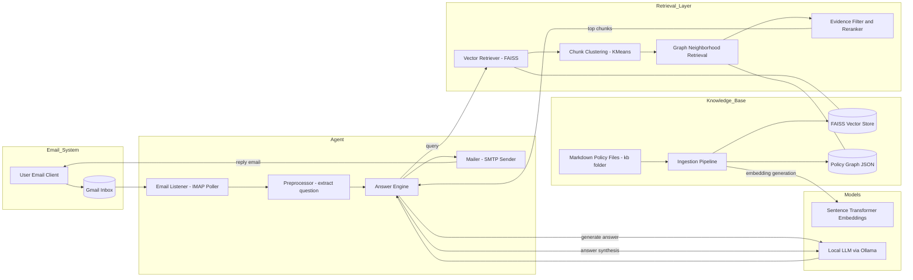

# vector_graph_rag

Email Policy Assistant — Local Vector + Graph RAG

Overview
--------
`vector_graph_rag` is an offline, email-driven policy assistant that
processes incoming Gmail messages and answers policy questions using a
local knowledge base. It combines vector retrieval (FAISS) with a
policy graph for neighborhood expansion and runs on local LLMs (via
Ollama) without relying on paid cloud APIs.

Key features
------------
- Gmail IMAP listener and automatic replies
- Local LLM support (Ollama models such as Qwen / Mistral)
- Hybrid Vector + Graph RAG retrieval with source citations
- Cross-document synthesis and confidence scoring
- Incremental KB rebuild support

Quickstart
----------
Requirements
# vector_graph_rag

Email Policy Assistant — Local Vector + Graph RAG

Overview
--------
`vector_graph_rag` is an offline, email-driven policy assistant that
processes incoming Gmail messages and answers policy questions using a
local knowledge base. It combines vector retrieval (FAISS) with a
policy graph for neighborhood expansion and runs on local LLMs (via
Ollama) without relying on paid cloud APIs.

Key features
------------
- Gmail IMAP listener and automatic replies
- Local LLM support (Ollama models such as Qwen / Mistral)
- Hybrid Vector + Graph RAG retrieval with source citations
- Cross-document synthesis and confidence scoring
- Incremental KB rebuild support

Quickstart
----------
Requirements
- Python 3.9+
- macOS or Linux recommended
- Ollama installed and a pulled model (example: `qwen2.5:3b`)
- Gmail App Password for IMAP/SMTP access

Install dependencies
```bash
pip install -r requirements.txt
brew install ollama   # macOS (optional)
ollama pull qwen2.5:3b
```

Configure
- Edit `config.py` to set Gmail credentials, Ollama model name,
  KB folder path, and polling interval.

Build the knowledge base
```bash
rm -rf faiss_store
python ingest_kb.py
python policy_graph_builder.py   # optional but recommended
```

Run the email agent
```bash
python email_listener.py
```

Project structure
-----------------
At a glance:

```text
.
├── kb/                       # Markdown knowledge base files
├── faiss_store/              # Persisted vector & graph index
├── ingest_kb.py              # Builds embeddings & FAISS index
├── policy_graph_builder.py   # Constructs policy graph JSON
├── agent.py                  # Core RAG + graph reasoning logic
├── email_listener.py         # Gmail polling + auto-reply loop
├── mailer.py                 # SMTP sending utility
├── config.py                 # Configuration and constants
└── requirements.txt
```

Data files
----------
- `kb/`: source policy documents (Markdown).
- `faiss_store/`: serialized vector index and graph JSONs.
- `memory/` and `storage/`: runtime and persisted stores (docstore, graph, index snapshots).

Usage examples
--------------
Example queries to email the assistant:
- "When are invoices generated?"
- "How do I delete my account?"
- "If I cancel after trial, am I billed?"

What happens
--------------
1. Agent polls inbox and collects unread messages.
2. Message text is used to retrieve vector candidates from FAISS.
3. Candidate set is clustered and expanded using the policy graph.
4. Answers are synthesized from evidence, ranked, and returned with
   source citations and a confidence score.

Architecture (brief)
--------------------
- Chunk Markdown KB → embeddings (SentenceTransformers) → FAISS
- Graph JSON links policy entities and supports neighborhood expansion
- Local LLM (Ollama) performs answer synthesis and re-ranking

Architecture diagram
--------------------


Contributing
------------
- Add or update policy pages in `kb/` (Markdown).
- Rebuild index with `python ingest_kb.py` after changes.
- Open issues or PRs for improvements.


